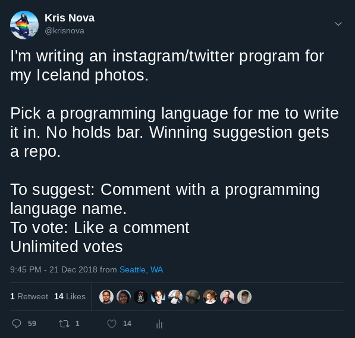
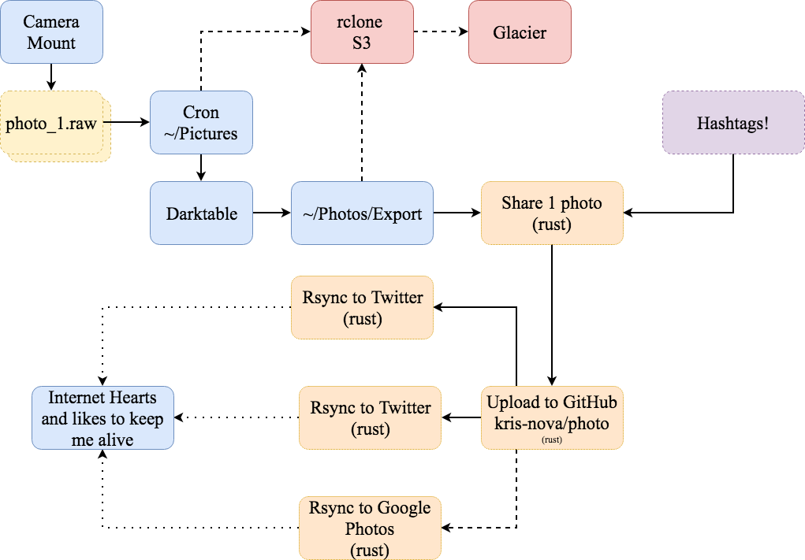

# Kris Nova Photo

<b>You picked the language, here is the program.</b>

My photography system, written in Rust.  

# Goals

 - Offer high quality images to the internet, without introducing a burden to myself
 - Promote the images via my main twitter and instagram pages
 - Not to get banned from either service for automating too much
 - Write this in Rust because the internet hates me

Over engineered photography laziness.

# Non goals

 - Make this consumable for anyone else

# Constraints

 - The instagram API does *not* allow direct uploading of pictures
 - Failures are common while uploading large pictures

# Stretch goals

 - Each photography directory creates a google photos album

